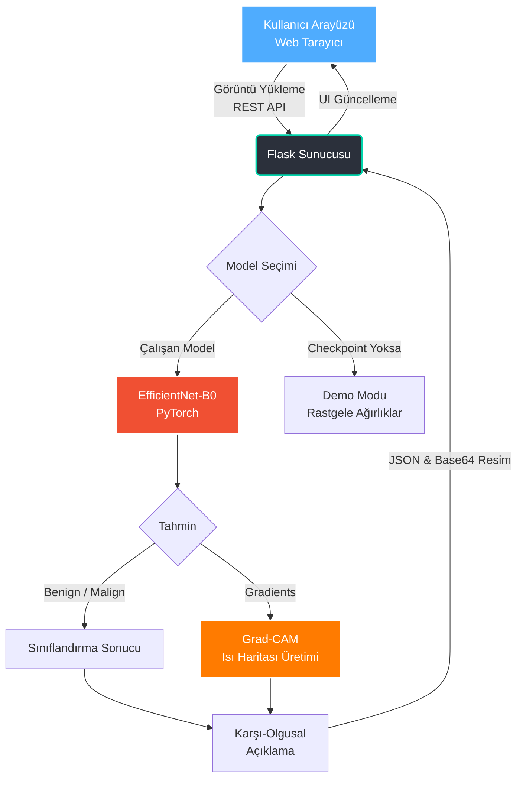

# XAI-GYN 🔬

> **Açıklanabilir Yapay Zeka ile Kadın Hastalıklarında Akıllı Görüntü Analizi**  
> Kolposkopi görüntülerinde Benign/Malign sınıflandırma + Grad-CAM ısı haritası

---

## 🚀 Hızlı Başlangıç (Windows)

```bash
# 1. setup_and_run.bat dosyasını çalıştırın
setup_and_run.bat

# Tarayıcıda açın:
# http://localhost:5000
```

---

## 📁 Proje Yapısı

```
xai-gyn/
├── src/
│   ├── preprocess.py     # CLAHE kontrast artırma, augmentation
│   ├── dataset.py        # PyTorch Dataset (benign/malign klasörleri)
│   ├── model.py          # EfficientNet-B0 tabanlı sınıflandırıcı
│   ├── train.py          # Eğitim döngüsü (early stopping, checkpoint)
│   ├── evaluate.py       # Accuracy, AUC-ROC, F1, Confusion Matrix
│   └── xai/
│       ├── gradcam.py    # Grad-CAM ısı haritası + karşı-olgusal açıklama
│       ├── lime_explain.py
│       └── shap_explain.py
├── web/
│   ├── app.py            # Flask REST API
│   ├── static/           # CSS + JS
│   └── templates/        # HTML arayüzü
├── tests/                # Unit testler
├── data/
│   └── sample/           # Demo görüntüleri buraya koyun
│       ├── benign/
│       └── malign/
├── models/checkpoints/   # Eğitim sonrası model ağırlıkları
├── demo_inference.py     # CLI demo
├── requirements.txt
└── setup_and_run.bat     # Tek tıkla başlatma (Windows)
```

---

## 🏗️ Mimari ve Veri Akışı



---

## 🧠 Model

| Bileşen | Seçim |
|---|---|
| Mimari | EfficientNet-B0 (pretrained ImageNet) |
| Çıktı | 2 sınıf: Benign / Malign |
| Optimizer | AdamW + ReduceLROnPlateau |
| XAI | Grad-CAM + LIME + SHAP |

---

## 📊 Model Eğitimi

```bash
# Veri hazırlığı:
# data/processed/benign/ klasörüne benign görüntüleri koyun
# data/processed/malign/ klasörüne malign görüntüleri koyun

python -m src.train --data_dir data/processed --epochs 50
```

---

## 🖥️ Web Arayüzü

```bash
cd web
python app.py
# → http://localhost:5000
```

**Özellikler:**
- 📤 Drag & drop görüntü yükleme
- ⚡ Gerçek zamanlı AI analizi
- 🔥 Grad-CAM ısı haritası
- 📊 Animasyonlu risk skoru (gauge)
- 💡 Karşı-olgusal açıklama metni
- ⬇️ PNG olarak sonuç indirme

---

## 📉 CLI Demo

```bash
python demo_inference.py --image data/sample/benign/ornek.jpg --save output/gradcam.png
```

---

## 🧪 Testler

```bash
pip install pytest
python -m pytest tests/ -v
```

---

## 📦 Gereksinimler

Python 3.9+ gerektirir.

```bash
pip install -r requirements.txt
```

---

## ⚠️ Sorumluluk Reddi

Bu proje **araştırma ve eğitim amaçlıdır**. Klinik tanı kararları için yetkili tıbbi uzman görüşü alınmalıdır.

---

## 📚 Veri Setleri (Önerilen)

- [SIPaKMeD](https://www.cs.uoi.gr/~marina/sipakmed.html) — Servikal sitoloji
- [MobileODT](https://www.kaggle.com/c/intel-mobileodt-cervical-cancer-screening) — Kolposkopi
- [Herlev Dataset](http://mde-lab.aegean.gr/index.php/downloads) — Servikal hücre

> **Yerel veri:** `veri setleri/celler_150200` dizininde 1000+ hücre görüntüsü var. Bu dosyaların GitHub `veri setleri` klasörüne eklenmesi için aşağıdaki adımları takip edin.
